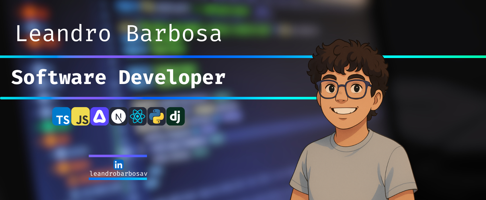

  

<h3 align="center">
  
    
  
  Software Developer • Back-end <!--Specialist-->
  
    
  
</h3>

  
  
   
  
  
  

 

## &nbsp;My Stack 

  

 

## &nbsp;About me 

-  Hello there! My name is **Leandro Barbosa** and I am a **Software Developer**.  
-  My current goal is become a **Full-stack Developer**. 
-  My main stack is **JavaScript/TypeScript**. 
-  I am a technology enthusiast, consistently seeking to expand my knowledge. 
-  Currently, I am studying **back-end development** and **advanced TypeScript**.
-  I am here to make a valuable contribution to the developer community.
-  **It's dangerous to go alone! [Follow me!](https://github.com/LeandroBarbosa753)**

##  &nbsp;Pinned Repositories

<table>
  <thead>
    <tr>
      <th colspan="2" width="2000">&nbsp;</th>
    </tr>
  </thead>
  <tbody>
    <tr>
      <td align="center" valign="top" width="80"> 
        
      </td>
      <td valign="top">
        <h3>ToolShare</h3>
        
Tool rentals with item management.

        
      </td>
    </tr>
    <tr>
      <td align="center" valign="top" width="80"> 
        
      </td>
      <td valign="top">
        <h3>ChefMaster</h3>
        
API integration with Expo

        
      </td>
    </tr>
  </tbody>
</table>

<h2 align="left" style="display: flex; align-items: center; gap: 10px; font-weight: 700; font-size: 1.8rem;">
  Contact Me
  
</h2>

  
  
  

 

  

    Credits
    
  
 
  <ul style="margin-top: 8px; padding-left: 20px; line-height: 1.5;">
    <li>GitHub Stats by <a href="https://github.com/anuraghazra/github-readme-stats" target="_blank" rel="noopener noreferrer">anuraghazra</a></li>
    <li>Skill Icons by <a href="https://skillicons.dev" target="_blank" rel="noopener noreferrer">skillicons.dev</a></li>
    <li>Github Animated Emojis by <a href="https://github.com/Tarikul-Islam-Anik/Animated-Fluent-Emojis" target="_blank" rel="noopener noreferrer">Tarikul-Islam-Anik</a></li>
  </ul>

